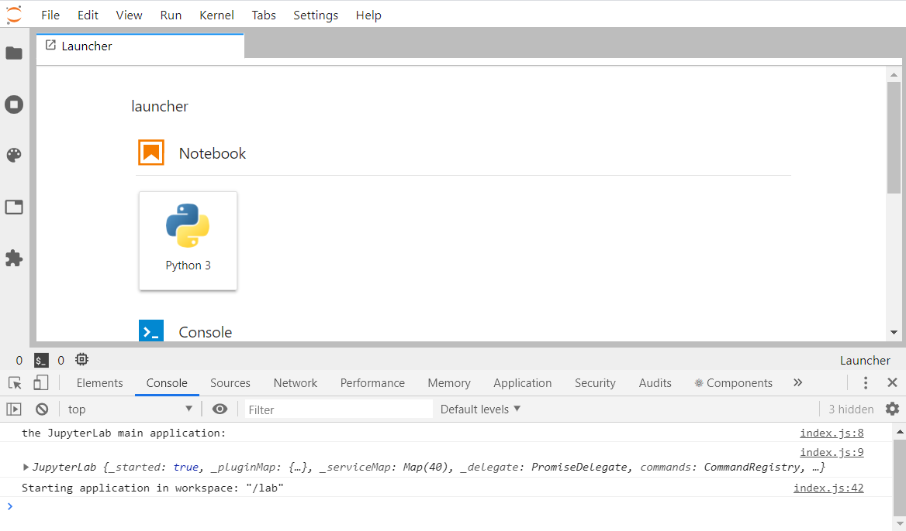
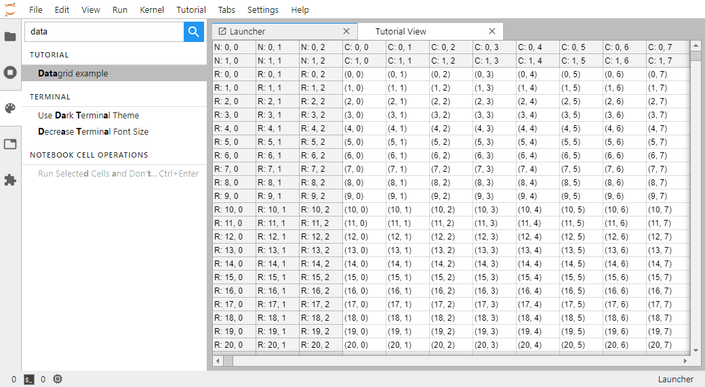
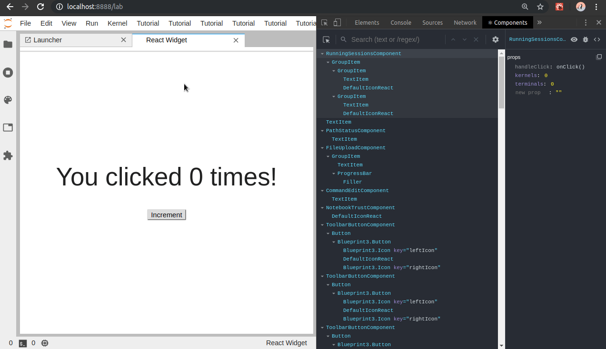
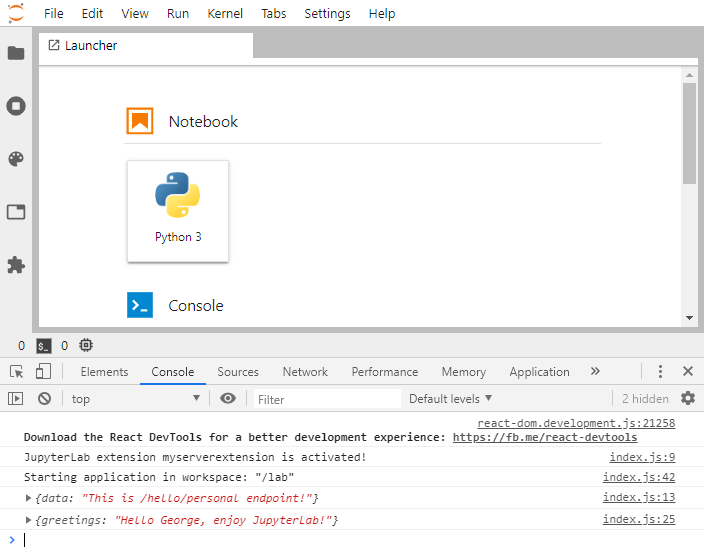

# JupyterLab Extensions by Examples


[](https://mybinder.org/v2/gh/jupyterlab/extension-examples/master?urlpath=lab)

## TL;DR

The goal of this repository is to show how to develop extensions for [JupyterLab](https://github.com/jupyterlab/jupyterlab), presented as short tutorial series.

To get started:

```bash
git clone https://github.com/jupyterlab/extension-examples.git && \
  cd jupyterlab-extension-examples && \
  conda env create && \
  conda activate jupyterlab-extension-examples && \
  cd basics/hello-world && \
  jlpm && \
  jlpm run build && \
  jupyter labextension link . && \
  jupyter lab
```

The examples currently target **JupyterLab 2.x**. If you would like to use the examples with JupyterLab 1.x, check out the [1.x branch](https://github.com/jupyterlab/extension-examples/tree/1.x). Note that the `1.x` branch is not updated anymore.

## Develop by Examples

You may find it easier to learn how to create extensions _by examples_, instead of going through the documentation.

Start with the [Hello World](basics/hello-world) and then jump to the topic you are interested in.

- [Hello World](basics/hello-world)
- [Signals](basics/signals)
- [Datagrid](basics/datagrid)
- [Command Palette](command-palette)
- [Commands](commands)
- [Launcher](launcher)
- [Main Menu](main-menu)
- [Settings](settings)
- [State](state)
- [React Widget](react/react-widget)
- [Widgets](widget-tracker/widgets)
- [Kernel Output](advanced/kernel-output)
- [Kernel Messaging](advanced/kernel-messaging)
- [Server Hello World](advanced/server-extension)

You can expect from each example:

- An explanation of its functionality.
- An image or screencast showing its usage.
- The list of used JupyterLab API and Extension Points.
- Explanations of the internal working, illustrated with code snippets.

We have structured the examples based on the [extension points](https://jupyterlab.readthedocs.io/en/stable/developer/extension_points.html). Browse the previews below or skip them and [jump directly to the sections for developers](#prerequisites).

You are welcome to open any [issue](https://github.com/jupyterlab/extension-examples/issues) or [pull request](https://github.com/jupyterlab/extension-examples/pulls).

## Basic

### [Hello World](basics/hello-world)

Set up the development environment and print to the console.

[](basics/hello-world)

### [Signals](basics/signals)

Use Signals to allow Widgets communicate with each others.

[](basics/signals)

### [Datagrid](basics/datagrid)

Display a Datagrid as a Lumino Widget.

[](basics/datagrid)

## Command Palette

### [Command Palette](command-palette)

Register commands in the Command Palette.

[](command-palette)

## Commands

### [Commands](commands)

Extend the main app with a Command.

[](commands)

## Launcher

### [Launcher](launcher)

Start your extension from the Launcher.

[](launcher)

## Menus

### [Main Menu](main-menu)

Add a Menu to the main app.

[](main-menu)

## Settings

### [Settings](settings)

Create and use new Settings for your extension.

[](settings)

## State

### [State](state)

Use State persistence in an extension.

[](state)

## React

### [React Widget](react/react-widget)

Create a React.js Widget in JupyterLab.

[](react/react-widget)

## Widget Tracker

### [Widgets](widget-tracker/widgets)

Add a new Widget element to the main window.

[](widget-tracker/widgets)

## Advanced

### [Kernel Output](advanced/kernel-output)

Render kernel messages in an OuputArea.

[](advanced/kernel-output)

### [Kernel Messaging](advanced/kernel-messaging)

Interact with a kernel from an extension.

[](advanced/kernel-messaging)

### [Server Hello World](advanced/server-extension)

Create a minimal extension with backend (i.e. server) and frontend parts.

[](advanced/server-extension)

## Prerequisites

Writing an extension requires basic knowledge of JavaScript, Typescript and potentially Python.

_Don't be scared of Typescript, even if you never coded in TypeScript before you touch
JupyterLab you may find it easier to understand than pure JavaScript if you have a
basic understanding of object oriented programming and types._

These examples are developed and tested on top of JupyterLab version 1.2.
You can create a [conda](https://docs.conda.io/en/latest/miniconda.html) environment to get started.

```bash
conda env create && \
  conda activate jupyterlab-extension-examples
```

## Develop and Use the Examples

### Build and Link all Examples at once

```bash
jlpm
jlpm build-ext
jlpm link-ext
jlpm build-jlab
jupyter lab
```

To clean the lib folders:

```bash
jlpm clean-ext
```

### Build and Link one Example

Go to the example directory you want to install, e.g. `cd ./basics/hello-world`, and run the following commands:

```bash
jlpm install
jlpm run build
jupyter labextension link .
```

Rebuild the JupyterLab application:

```bash
jlpm run build
jupyter lab build
```

You can now start JupyterLab and check if your extension is working fine:

```bash
jupyter lab
```

### Change the Sources

If you want to develop and iterate on the code, you will need to open 2 terminals.

In terminal 1, go to the extension folder and run the following:

```bash
jlpm watch
```

Then in terminal 2, start JupyterLab with the watch flag:

```bash
jupyter lab --watch
```

From there, you can change your extension source code, it will be recompiled,
and you can refresh your browser to see your changes.

We are using [embedme](https://github.com/zakhenry/embedme) to embed code snippets into the markdown READMEs. If you make changes to the source code, ensure you update the README and run `jlpm embedme` from the root of the repository to regenerate the READMEs.

## Install a Published Extension

Once your extension is published (outside of this scope), you can install it
with the following command:

```bash
jupyter labextension install <published_extension>
```

## About JupyterLab

JupyterLab can be used as a platform to combine existing data-science components into a
new powerful application that can be deployed remotely to many users. Some of the higher
level components that can be used are text editors, terminals, notebooks, interactive widgets,
filebrowser, renderers for different file formats that provide access to an enormous ecosystem
of libraries from different languages.

Complementary to these examples, you can rely on the official JupyterLab documentation.

- [Extension Developer Guide](https://jupyterlab.readthedocs.io/en/stable/developer/extension_dev.html)
- [Common Extension Points](https://jupyterlab.readthedocs.io/en/stable/developer/extension_points.html)
- [Astronomy Picture of the Day JupyterLab Extension](https://jupyterLab.readthedocs.io/en/stable/developer/extension_tutorial.html)

## Credits

We would like to thank [MMesch](https://github.com/MMesch) for [initiating this work](https://github.com/MMesch/labextension_tutorial), as well as everyone else who contributed!


## Community Guidelines and Code of Conduct

This examples repository is Jupyter project and follows the Jupyter
[Community Guides and Code of Conduct](https://jupyter.readthedocs.io/en/latest/community/content-community.html).
