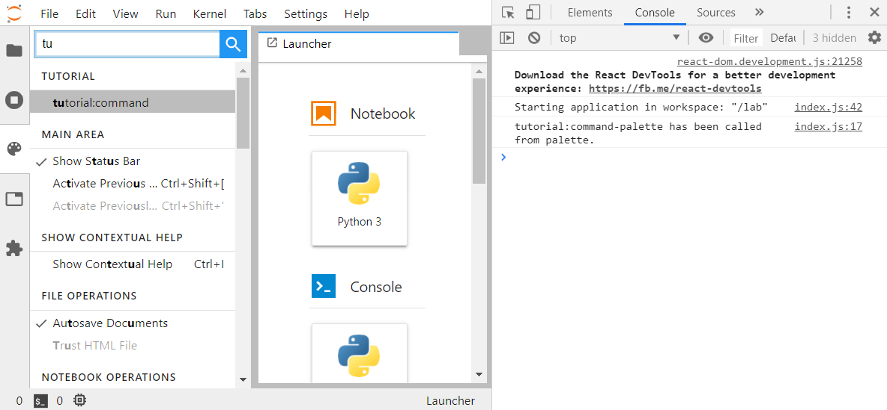

# Command Palette: Extending the main app

One major concept of the phosphorjs library on which JupyterLab is built is
the notion of _Commands_ as explained in the [commands example](../commands/README.md).
One of the possibility offered to the user to trigger that command is to call it from
the command palette.

In this extension, we are going to add a command to command palette.

The command palette interface `ICommandPalette` need to be imported with:

```ts
// src/index.ts#L6-L6

import { ICommandPalette } from '@jupyterlab/apputils';
```

To see how we add the command to the palette, let's have a look at `src/index.ts`.

```ts
// src/index.ts#L11-L35

const extension: JupyterFrontEndPlugin<void> = {
  id: 'command-palette',
  autoStart: true,
  requires: [ICommandPalette],
  activate: (app: JupyterFrontEnd, palette: ICommandPalette) => {
    const { commands } = app;

    let command = 'tutorial:command-palette';

    // Add a command
    commands.addCommand(command, {
      label: 'tutorial:command',
      caption: 'Execute tutorial:command-palette',
      execute: (args: any) => {
        console.log(
          `tutorial:command-palette has been called ${args['origin']}.`
        );
      }
    });

    // Add the command to the command palette
    let category = 'Tutorial';
    palette.addItem({ command, category, args: { origin: 'from palette' } });
  }
};
```

The `ICommandPalette`
([documentation](https://JupyterLab.github.io/JupyterLab/interfaces/_apputils_src_commandpalette_.icommandpalette.html))
is passed to the `activate` function as an argument (variable `palette`) in
addition to the JupyterLab application (variable `app`). We request that dependency
with the property `requires: [ICommandPalette],`. It lists the additional arguments
we want to inject into the `activate` function in the `JupyterFontEndPlugin`.

`ICommandPalette` provides the method `addItem` that links a palette entry to a command in the command registry. It requires two arguments: the unique command id and the command
category (that can be either an existing or a new one). And optionnaly, you can specify
the arguments that will be passed to the command when executed from the palette.

When running JupyterLab with this extension active, the following message should
appears in the web browser console after clicking on the command in the palette:



## Where to Go Next

A command can be triggered by other UI elements:

- Add the command to a [menu](../../main-menu/README.md)
- Add the command to a [context menu](../../context-menu/README.md)
- Add the command to the [launcher](../../launcher/README.md)
